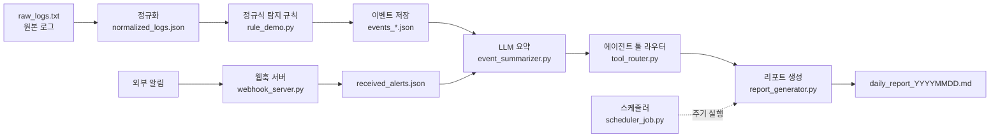

<div align="center">

# 🛡️ security-agent-toolkit

**보안 로그 수집 → 탐지 → LLM 요약 → 에이전트 툴 호출 → 일일 리포트 자동 생성**
파이썬 기초부터 AI 에이전트까지, 보안 자동화 파이프라인을 처음부터 끝까지 직접 구현한 프로젝트


</div>

---

## 📑 목차

1. [프로젝트 한눈에 보기](#-프로젝트-한눈에-보기)
2. [해결하려던 문제](#-해결하려던-문제)
3. [전체 아키텍처](#-전체-아키텍처)
4. [모듈별 상세 설명](#-모듈별-상세-설명)
5. [학습 & 구현 과정](#-학습--구현-과정-2주간의-기록)
6. [핵심 역량 정리](#-핵심-역량-정리)
7. [트러블슈팅 기록](#-트러블슈팅-기록)
8. [실행 방법](#-실행-방법)
9. [산출물 예시](#-산출물-예시)
10. [한계와 개선 계획](#-한계와-개선-계획)
11. [작성자](#-작성자)

---

## 🔎 프로젝트 한눈에 보기

| 항목 | 내용 |
|------|------|
| 기간 | 2026.09.22 ~ 2026.10.08 (일자별 노트북 16개) |
| 형태 | 개인 프로젝트 |
| 목표 | 보안 운영의 반복 업무(로그 확인 → 탐지 → 요약 → 보고)를 코드로 자동화 |
| 결과물 | 로그 정규화, 탐지 규칙, 웹훅 서버, 스케줄러, LLM 요약, 에이전트 툴 라우터, 일일 리포트 생성기 |
| 특징 | 변수·리스트 수준의 기초부터 시작해 **매일 한 단계씩 기능을 쌓아** 하나의 파이프라인으로 완성 |

## 🎯 해결하려던 문제

보안 운영에서는 같은 작업이 매일 반복됩니다.

- 형식이 제각각인 **원본 로그**를 사람이 읽고 정리해야 한다
- 위험한 이벤트를 **놓치지 않고 분류**해야 한다
- 쏟아지는 알림을 **요약해서 보고**해야 한다

이 과정을 **데이터 정규화 → 규칙 기반 탐지 → LLM 요약 → 자동 리포트**로 나눠 각각 직접 구현하고, 마지막에 하나의 흐름으로 연결했습니다.

## 🧩 전체 아키텍처



## 🔧 모듈별 상세 설명

### 1. 로그 수집·정규화
- `raw_logs.txt` 같은 비정형 텍스트 로그를 파싱해 **구조화된 JSON**(`normalized_logs.json`)으로 변환
- 중첩 JSON 구조를 다루고, 필드를 일관된 형태로 맞추는 작업 포함
- 입력이 깨져 있거나 비어 있는 경우를 대비한 **예외 처리와 로깅** 적용

### 2. 정규식 탐지 규칙
- 로그 패턴을 정규식으로 정의해 이벤트 유형을 분류 (`rule_demo.py`)
- 규칙을 코드에 박아 두지 않고 **규칙 API로 분리**해 관리·확장할 수 있도록 설계
- 처리한 ID를 기록(`processed_ids.json`)해 **중복 처리를 방지**

### 3. 웹훅 서버 & 스케줄러
- 외부 알림을 받는 웹훅 서버를 **단계별로 확장**
  `hello_server` → `echo_server` → `count_server` → `save_server` → `webhook_server`
- 받은 알림을 `received_alerts.json`에 저장하고, `test_webhook.sh`로 요청을 재현해 검증
- `scheduler_job.py`로 **정해진 시간에 작업이 자동 실행**되도록 트리거 구성

### 4. LLM 요약 & 에이전트 툴 호출
- `llm_client.py`: LLM 호출을 한 곳에 모은 클라이언트 (API 키는 `.env`로 분리)
- `event_summarizer.py`: 이벤트를 프롬프트에 담아 요약 → `event_summaries.json`, `sorted_summaries.json`
- `tool_router.py` + `agent_core/`: LLM이 **어떤 도구를 호출할지 결정**하고 실행 결과를 돌려받는 구조 (`agent_result.json`)

### 5. 일일 리포트 생성
- 일자별 이벤트(`events_1007.json`, `events_1008.json`)를 모아 **마크다운 리포트 자동 생성**
- 설정 기반 파이프라인으로 정리해 날짜만 바꿔도 같은 흐름으로 리포트 산출

## 📅 학습 & 구현 과정 (2주간의 기록)

> 단순히 문법을 공부한 것이 아니라, **매일 "오늘 배운 것"을 보안 자동화 기능 하나로 연결**하는 방식으로 진행했습니다.

### 🟢 1단계. 파이썬 기초 → 데이터 다루기 (09/22 ~ 09/23)
| 노트북 | 배운 것 | 보안 업무와의 연결 |
|--------|---------|-------------------|
| `260922_variables_and_lists` | 변수, 자료형, 리스트 | 로그 한 줄을 데이터로 담는 기본 단위 |
| `260923_am_conditions_loops_counting` | 조건문, 반복문, 카운팅 | 이벤트 유형별 발생 횟수 집계 |
| `260923_pm_functions_files_csv` | 함수, 파일 입출력, CSV | 로그 파일 읽기와 처리 로직 재사용 |

### 🟡 2단계. 안정성 & 구조화 (09/28)
| 노트북 | 배운 것 | 보안 업무와의 연결 |
|--------|---------|-------------------|
| `260928_am_exceptions_logging` | 예외 처리, `logging` | 비정상 로그에도 멈추지 않는 파이프라인 |
| `260928_pm_nested_json` | 중첩 JSON 탐색·변환 | 알림 페이로드, 정규화 결과 구조 설계 |

### 🟠 3단계. 탐지 & API (09/29 ~ 09/30)
| 노트북 | 배운 것 | 보안 업무와의 연결 |
|--------|---------|-------------------|
| `260929_am_regex_detection_rules` | 정규식 패턴 설계 | 로그 패턴 기반 탐지 규칙 |
| `260929_pm_rules_api` | 규칙을 API로 제공·조회 | 규칙 관리 분리, 확장성 확보 |
| `01_0930_am_requests_api_client` | `requests`로 API 호출 | 외부 서비스와 통신하는 클라이언트 (`api_client.py`) |

### 🔴 4단계. 자동화 (10/02)
| 노트북 | 배운 것 | 보안 업무와의 연결 |
|--------|---------|-------------------|
| `261002_am_webhook_cli` | 웹훅 서버, CLI, 포트 개념 | 외부 알림 실시간 수신 |
| `261002_pm_trigger_scheduler` | 트리거와 스케줄러 | 사람 없이 주기적으로 파이프라인 실행 |

### 🟣 5단계. AI 에이전트 (10/06)
| 노트북 | 배운 것 | 보안 업무와의 연결 |
|--------|---------|-------------------|
| `261006_am_llm_prompt` | LLM 프롬프트 설계, API 호출 | 이벤트 요약 품질을 좌우하는 프롬프트 |
| `261006_pm_agent_tools` | 에이전트 툴 정의·라우팅 | LLM이 상황에 맞는 도구를 골라 실행 |

### 🔵 6단계. 리포트 & 통합 (10/07 ~ 10/08)
| 노트북 | 배운 것 | 보안 업무와의 연결 |
|--------|---------|-------------------|
| `261007_am_report_summary` | 이벤트 요약 정리·정렬 | 중요도순 요약 (`sorted_summaries.json`) |
| `261007_pm_report_generator` | 리포트 자동 생성 | 일일 보고서 산출 |
| `261008_am_config_pipeline` | 설정 기반 파이프라인 | 전 과정을 하나의 흐름으로 통합 |
| `261008_pm_review_debug_retro` | 코드 리뷰, 디버깅, 회고 | 전체 점검과 개선점 도출 |

## 🧠 핵심 역량 정리

| 영역 | 내용 |
|------|------|
| **Python 기본기** | 자료형, 제어문, 함수, 파일·CSV·JSON 처리 |
| **안정적인 코드** | 예외 처리, 로깅, 중복 처리 방지 |
| **보안 탐지** | 정규식 기반 탐지 규칙 설계, 규칙 API 분리 |
| **네트워크/서버** | 웹훅 서버, 포트, REST API 호출, curl/Bash 테스트 |
| **자동화** | 스케줄러·트리거, 설정 기반 파이프라인 |
| **AI 활용** | LLM 프롬프트 설계, 에이전트 툴 호출 구조 |
| **개발 습관** | `.env`로 비밀 정보 분리, 일자별 기록, 디버깅·회고 |

## 🐞 트러블슈팅 기록

<!-- TODO: 실제로 겪은 문제 3~4개를 아래 형식으로 채워 주세요. 이 섹션이 가장 큰 차별점이 됩니다 -->

| 문제 | 원인 | 해결 |
|------|------|------|
| (예) 웹훅 서버가 포트 충돌로 실행되지 않음 | 이미 사용 중인 포트 | `port_demo.py`로 점검 후 포트 변경 |
| (예) JSON 필드가 없어 KeyError 발생 | 로그마다 구조가 다름 | `.get()` 기본값 처리, 예외 로깅 |
| (예) LLM 응답 형식이 매번 달라짐 | 프롬프트의 출력 형식 지정 부족 | 출력 형식을 명시하고 파싱 검증 추가 |

## 🚀 실행 방법

```bash
# 1. 저장소 가져오기
git clone https://github.com/lhyejin0205/security-agent-toolkit.git
cd security-agent-toolkit

# 2. 환경 변수 설정
cp .env.example .env     # API 키 등 입력 (.env는 커밋 금지)

# 3. 웹훅 서버 실행
python webhook_server.py

# 4. 다른 터미널에서 테스트 알림 전송
bash test_webhook.sh

# 5. 리포트 생성
python report_generator.py
```

각 단계는 일자별 노트북(`*.ipynb`)으로도 따라 해 볼 수 있습니다.

## 📄 산출물 예시

| 파일 | 설명 |
|------|------|
| `daily_report_20261007.md`, `daily_report_20261008.md` | 자동 생성된 일일 보안 리포트 |
| `event_summaries.json` / `sorted_summaries.json` | LLM이 만든 이벤트 요약 / 정렬 결과 |
| `agent_result.json` | 에이전트 툴 호출 결과 |
| `normalized_logs.json` | 정규화된 로그 |

<!-- TODO: 리포트 스크린샷 또는 리포트 일부를 코드블록으로 첨부하세요 -->

## 🔭 한계와 개선 계획

- [ ] 단위 테스트 추가 (탐지 규칙의 오탐/미탐 검증)
- [ ] `requirements.txt` 정리 및 실행 환경 재현성 확보
- [ ] 탐지 규칙 확장 (유형·심각도 분류 체계)
- [ ] 리포트 자동 발송(메일/메신저) 연동
- [ ] 로그 소스 다양화 (실제 서버·네트워크 장비 로그)

## 👤 작성자

**임혜진**
작업치료를 전공하고 병원 연구보조로 일한 뒤, 데이터와 자동화로 영역을 넓혀 가고 있습니다.
GitHub · [@lhyejin0205](https://github.com/lhyejin0205)
